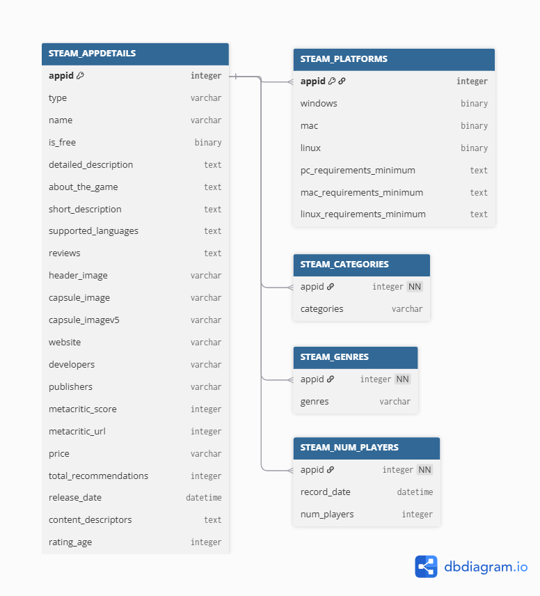
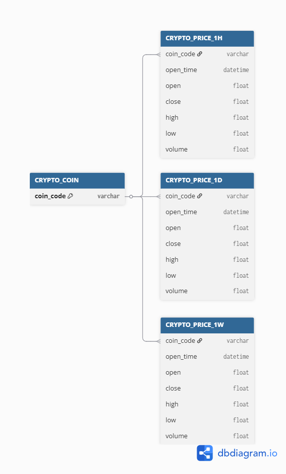

# TEACHING DATA REPO

This repository collects and structures multiple public datasets for study, teaching, and analysis purposes.
Each dataset is organized in a separate folder and includes scripts for automatic data collection and updates.

Each dataset folder contains:

- A local database (.duckdb)
- Data collection or update scripts (R )

Maximum total databases should be 500MB

#### Clone the project:

```r
git clone https://github.com/dvthuycuc/teaching-data.git
```

## Steam Data

The Steam dataset consists of five main tables, linked by the appid field (the unique identifier of each game on Steam).

<p align="center">  </p>

| Table                 | Description                                                                        |
| --------------------- | ---------------------------------------------------------------------------------- |
| **STEAM_APPDETAILS**  | Core game information (name, description, developer, publisher, Metacritic score). |
| **STEAM_PLATFORMS**   | Supported operating systems and minimum system requirements.                       |
| **STEAM_CATEGORIES**  | Game categories such as "Single-player", "Multiplayer", etc.                       |
| **STEAM_GENRES**      | Game genres such as "Action", "Adventure", "Strategy", etc.                        |
| **STEAM_NUM_PLAYERS** | Historical player count data with record date and number of players.               |

### How to Use

#### Copy or Download Database
(Optional) Download the pre-collected Steam database and place it into the folder:

```r
steam_data/
```

#### Update Game Information

```r
cd steam_data
Rscript update_steam_app.R
```

#### Update Today Number of Players:

Single Game
```r
Rscript update_steam_num_players.R <appid>
# Example:
Rscript update_steam_num_players.R 10
```

All games
```r
Rscript update_steam_num_players.R
```

#### Delete Data Number of Players:

Delete all data before a given days

Single Game
```r
Rscript delete_steam_num_players.R <days> <appid>
# Example:
Rscript delete_steam_num_players.R 730 10
```

All games
```r
Rscript delete_steam_num_players.R 730
```

## Crypto Data

The Crypto dataset consists of four main tables, linked by the coin_code field (the unique identifier of each cryptocurrency).

All market data is retrieved from the [Binance API](https://www.binance.com/en/binance-api)

<p align="center">  </p>

| Table               | Description                                                                                      |
| ------------------- | ------------------------------------------------------------------------------------------------ |
| **CRYPTO_COIN**     | Master list of all tracked cryptocurrencies with their unique `coin_code`.                       |
| **CRYPTO_PRICE_1H** | Hourly price data for each cryptocurrency, including open, close, high, low, and trading volume. |
| **CRYPTO_PRICE_1D** | Daily aggregated price data for each cryptocurrency.                                             |
| **CRYPTO_PRICE_1W** | Weekly aggregated price data for each cryptocurrency.                                            |

### How to Use

#### Copy or Download Database
(Optional) Download the pre-collected Crypto database and place it into the folder:

```r
crypto_data/
```

#### Add or Delete followup coincode
Use the script below to add or remove supported cryptocurrencies.

Examples:

BTCUSDT: Bitcoin price in USD

PAXGUSDT: Gold-backed token price in USD

```r
cd crypto_data
Rscript update_crypto_coincode.R <coin_code> <add|delete>
```

#### Update coin price data

Single code
```r
Rscript update_crypto_price.R <coin_code>
```

All code
```r
Rscript update_crypto_price.R
```

## Contact

For any questions or collaboration inquiries, please contact:  
**Van Thuy Cuc Dang**  
dvthuycuc@gmail.com  
Deggendorf Institute of Technology, Germany

**Prof. Dr. Tim Weber, Dipl.-Ing.(FH)**  
tim.weber@th-deg.de  
Deggendorf Institute of Technology, Germany